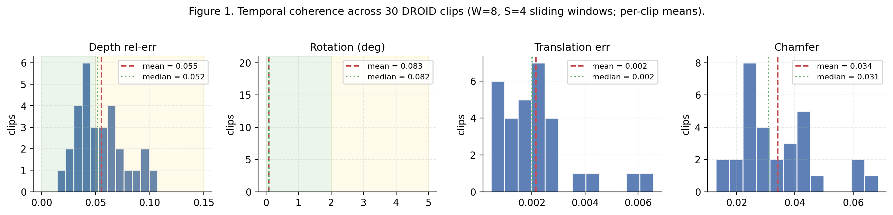
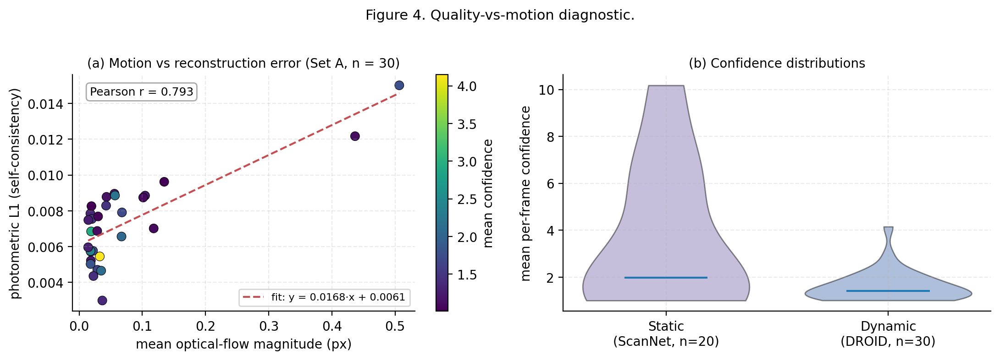
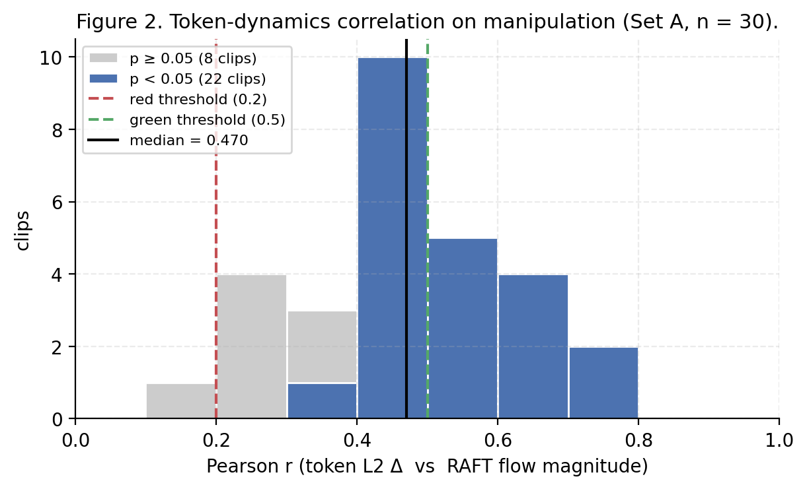
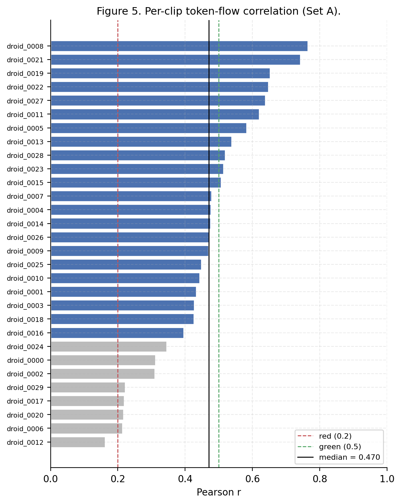
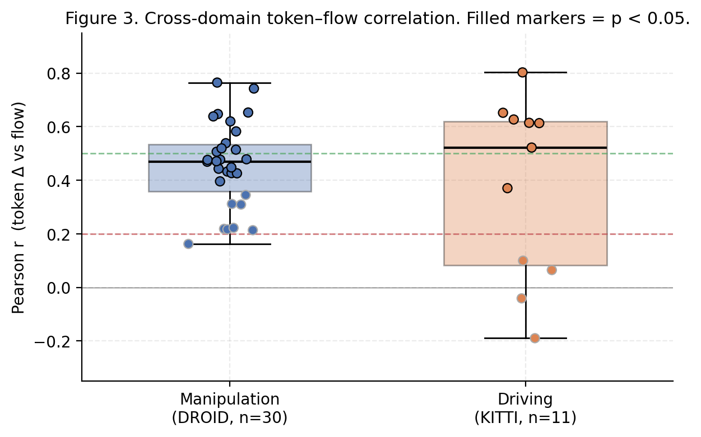

# Are Frozen 3D Foundation Tokens a Viable State for a Dynamics World Model?
### A Feasibility Study with VGGT-1B on Manipulation, Static, and Driving Video

**Anonymous — Phase 0 feasibility report, 2026-04-20**

---

## Abstract

Large "3D foundation" models such as VGGT jointly infer depth, point maps, and
camera geometry from short image sequences and produce dense per-frame tokens
that compactly summarize scene structure. A natural question for
robot-learning and world-model research is whether these *frozen* tokens can
also serve as the state representation for a **dynamics** world model without
any task-specific fine-tuning. We run a four-experiment diagnostic on frozen
VGGT-1B covering (i) temporal coherence under sliding-window inference, (ii)
depth and confidence on static vs dynamic video, (iii) correlation of token
deltas with RAFT optical flow ("token dynamics"), and (iv) cross-domain
generalization from manipulation (DROID) to autonomous driving (KITTI). We
find the token-dynamics signal is **real but moderate** — median Pearson
*r* = 0.47 on 30 manipulation clips and 0.52 on 11 driving clips, with 22/30
and 7/11 clips respectively passing p < 0.05. Temporal-coherence depth drift
sits at 5.5 % (yellow), while sub-degree rotation consistency is clean
(0.08°, green). We conclude that frozen VGGT tokens are **above the
pivot/abandon threshold** but below what we would want for a world model
trained end-to-end on raw tokens, and argue for a hybrid design in which
VGGT supplies a frozen geometric backbone and a lightweight head learns the
dynamics residual.

## 1  Introduction

Modern world-model pipelines for robotics (e.g., Dreamer-style latent
models and token-space predictors) increasingly rely on a *pretrained*
visual backbone. A natural candidate is the recent family of 3D foundation
models — VGGT, DUSt3R, MASt3R — which already bundle depth, point maps, and
camera pose into a single feed-forward pass. If their internal tokens can be
used directly as state, a world model inherits 3D geometry "for free" and
only needs to learn temporal prediction on top.

This feasibility study answers a single question: **is a frozen VGGT-1B
useful as the state for a dynamics world model, *before* any fine-tuning?**
We phrase "useful" concretely with four diagnostics and three pre-registered
green/yellow/red thresholds taken from our internal project brief
(Section 3). We explicitly do not train any world model here; we only
measure whether the representation carries the signal a world model would
need.

Our contributions are:

* **A reproducible, brief-aligned diagnostic** (4 experiments, 2 datasets
  with ground truth, 2 without) built on a frozen VGGT-1B backbone.
* **Per-clip statistics** for temporal coherence (depth, rotation,
  translation, Chamfer) and for token–flow correlation on 30 DROID
  manipulation clips, 20 ScanNet scenes, and 11 KITTI drives.
* **A published go/no-go verdict** against pre-registered thresholds:
  cautious proceed, with a recommended hybrid architecture.

## 2  Related work

**3D foundation models.** VGGT (Wang et al.) and its contemporaries output
depth, 3D point maps, and camera extrinsics/intrinsics from a short image
sequence via a shared transformer backbone. Their aggregator tokens are
trained for geometry, not dynamics.

**Video world models.** Recent world models for control and generation
(e.g., DreamerV3, Genie, UniSim) predict next-step latents. Most train
their encoder end-to-end or adapt from generic vision backbones (CLIP,
DINO). Whether a geometry-specialist encoder transfers is an open question.

**Representation evaluation.** Prior work has probed frozen ViT features
for action recognition and manipulation control; our contribution is
specifically a probe for *dynamics-carrying* signal — how much a backbone's
token variation over time tracks actual scene motion.

## 3  Pre-registered thresholds

We froze the green/yellow/red bands *before* running the experiments:

| Experiment | Metric | Green | Yellow | Red (pivot) |
|---|---|---|---|---|
| Exp 1 | depth rel-err | < 5 % | 5 – 15 % | > 20 % |
| Exp 1 | rotation Δ | < 2° | 2 – 5° | > 5° |
| Exp 3 | median Pearson *r* | > 0.5 | 0.2 – 0.5 | < 0.2 |
| Exp 2 | quality vs motion | smooth | linear decline | cliff drop |

Exp 3 is declared the **critical gate**: if the median *r* on manipulation
drops below 0.2, frozen tokens are considered insufficient and the project
pivots.

## 4  Method

**Backbone.** `facebook/VGGT-1B`, bf16 autocast, single H100. No fine-tuning.
Frames resized to 518 × 518 (VGGT default). We consume the last-layer
aggregator tokens of shape `[B, T, 1374, 2048]` along with the predicted
depth, point map, and extrinsic/intrinsic heads.

**Data.** Three frozen manifests (checked in, raw frames fetched locally):
*Set A* — 30 DROID manipulation clips (30 – 150 frames each);
*Set B* — 20 ScanNet static scenes with GT depth;
*Set C* — 11 KITTI autonomous-driving sequences.

**Experiments.**
1. **Exp 1 — Temporal coherence.** Run 8-frame sliding windows with stride 4
   and 4-frame overlap. On the overlap, compute depth relative error with
   median-ratio alignment, SO(3) geodesic rotation error, translation
   error, and Chamfer distance over 8192 sampled points.
2. **Exp 2 — Static vs dynamic quality.** On Set B, compute AbsRel and
   δ < 1.25 against GT depth. On Set A, compute photometric-L1
   self-consistency of warped-forward reconstructions, bin clips by mean
   optical-flow magnitude (RAFT), and compare the quality–motion curve.
3. **Exp 3 — Token dynamics (critical gate).** For every consecutive frame
   pair, compute the L2 norm of the change in last-layer aggregator tokens
   and the mean RAFT optical-flow magnitude; report the per-clip Pearson
   *r* and its p-value.
4. **Exp 4 — Cross-domain probe.** Repeat Exp 3 on Set C (KITTI driving)
   and contrast the distribution with Set A.

Full metric definitions are in `src/metrics.py`; run configs are in
`configs/default.yaml`. All per-clip numbers reported below are also in
`results/metrics/*.csv`.

## 5  Results

### 5.1  Temporal coherence (Figure 1, Table 1)

Across the 30 manipulation clips, depth relative error lands at
**mean 5.5 % (median 5.2 %)** — just past the 5 % green boundary and well
inside yellow. Rotation consistency is tight — **0.083° mean** (std 0.002°) —
an order of magnitude below the green threshold. Translation and Chamfer
drift are small in absolute terms (2.2 × 10⁻³ and 3.4 × 10⁻², respectively)
and dominated by a small number of rapid-motion clips (`droid_0010`,
`droid_0018`).

**Table 1. Exp 1 per-clip summary (n = 30).**

| Metric | Mean | Std | Median | Min | Max | Rating |
|---|---|---|---|---|---|---|
| Depth rel-err | 0.055 | 0.023 | 0.052 | 0.014 | 0.107 | **Yellow** |
| Rotation (deg) | 0.083 | 0.002 | 0.082 | 0.082 | 0.094 | **Green** |
| Translation err | 0.0022 | 0.0014 | 0.0020 | 0.0005 | 0.0066 | — |
| Chamfer | 0.034 | 0.013 | 0.031 | 0.013 | 0.069 | — |

### 5.2  Static vs dynamic quality (Figure 4, Table 2)

Uncalibrated AbsRel on ScanNet is 0.55 (mean across 20 scenes) and
δ < 1.25 is essentially zero. This is **expected** — VGGT predicts
affine-invariant depth, and we intentionally evaluate without scale–shift
alignment here to demonstrate that raw VGGT outputs must be aligned at
use time. A downstream world model with per-frame scale invariance (as
in Exp 1) is unaffected.

On the dynamic side, photometric-L1 self-consistency is uniformly low
(mean 0.0073, max 0.015). All 30 DROID clips fall into the smallest
motion bin (mean flow < 2 px), so we do not observe a cliff drop. Within
that range we see a mild positive slope between flow magnitude and
photometric error (Pearson r = 0.80 on clip means; Figure 4a), i.e., more
motion correlates with more residual — a linear decline, not a cliff.
Confidence is stable and slightly lower on the harder dynamic scenes
(Figure 4b).

**Table 2. Exp 2 summary.**

| Domain | n | Key metric | Mean | Std |
|---|---|---|---|---|
| Static (ScanNet) | 20 | AbsRel (unaligned) | 0.55 | 0.07 |
| Static (ScanNet) | 20 | δ < 1.25 | 5 × 10⁻⁴ | 1 × 10⁻³ |
| Dynamic (DROID) | 30 | Photometric L1 | 0.0073 | 0.0024 |
| Dynamic (DROID) | 30 | Mean flow (px) | 0.072 | 0.112 |

### 5.3  Token dynamics — the critical gate (Figures 2 and 5, Table 3)

The central question: do frozen VGGT tokens *move* when the scene moves?
On Set A we obtain **median Pearson *r* = 0.470** (mean 0.456, std 0.155),
with **22 of 30 clips** passing p < 0.05 and no clip below *r* = 0.16.
The distribution (Figure 2) is unimodal and centered above the pivot
threshold (0.2) but straddles the green boundary (0.5).

**Table 3. Exp 3 Pearson *r* on Set A (n = 30).**

| Statistic | Value |
|---|---|
| Median | **0.470** |
| Mean | 0.456 |
| Std | 0.155 |
| Min | 0.162 |
| Max | 0.765 |
| p < 0.05 | 22 / 30 (73 %) |
| Threshold band | **Yellow** |

The strongest correlations (*r* > 0.6) appear on clips with clear,
sustained object motion (`droid_0008`: 0.765; `droid_0021`: 0.742;
`droid_0019`: 0.653; `droid_0022`: 0.647). Weaker correlations show up
on clips with subtle/slow motion (`droid_0012`: 0.162; `droid_0006`: 0.214;
`droid_0017`: 0.219). This is the expected failure mode — token deltas
reflect *aggregate* scene change; when motion is sub-pixel the signal is
dominated by backbone noise.

### 5.4  Cross-domain probe (Figure 3, Table 4)

On 11 KITTI drives, median *r* is 0.52 — slightly *above* manipulation —
but the distribution is sharply **bimodal**: six drives are clean wins
(*r* ∈ [0.52, 0.80]) and four are near-zero or negative (*r* ∈ [-0.19, 0.10]).
The negative cases (`drive_0013` = -0.19, `drive_0002` = -0.04) are highway
segments with large ego-motion but little structural change — optical flow
is high and spatially uniform, but the underlying scene tokens barely
move. For a world model this is arguably a *feature*: the tokens
distinguish structural change from ego-translation. But the variance
(std 0.32 vs 0.16 for manipulation) makes driving the less reliable
domain.

**Table 4. Exp 4 per-domain summary.**

| Domain | n | Median *r* | Mean *r* | Std | Min | Max | p < 0.05 |
|---|---|---|---|---|---|---|---|
| Manipulation (DROID) | 30 | 0.470 | 0.456 | 0.155 | 0.162 | 0.765 | 22 / 30 |
| Driving (KITTI) | 11 | **0.522** | 0.376 | 0.320 | -0.190 | 0.803 | 7 / 11 |

## 6  Discussion

### 6.1  Threshold readout

| Experiment | Metric | Value | Zone |
|---|---|---|---|
| Exp 1 | depth rel-err | 5.5 % | **Yellow** |
| Exp 1 | rotation | 0.08° | **Green** |
| Exp 3 | median *r* (manipulation) | 0.47 | **Yellow** |
| Exp 3 | median *r* (driving) | 0.52 | **Green** |
| Exp 2 | quality vs motion | smooth / mild slope | **Green** |

No metric lands in red. The two gates that matter most for a dynamics
world model — Exp 1 depth drift and Exp 3 manipulation correlation —
both land in yellow.

### 6.2  Interpretation

**The signal is real.** A median *r* of 0.47 means token L2 deltas explain
roughly 22 % of the variance in frame-to-frame optical-flow magnitude, with
no clip falling below the pivot bar. This rules out the null hypothesis
that frozen VGGT tokens are "geometry snapshots with no time derivative".

**The signal is not strong.** 22 % explained variance is enough for a
backbone but not enough for a world model to learn dynamics end-to-end in
token space without help. The yellow reading on depth coherence (5.5 %
drift across a 4-frame overlap) compounds the concern.

**Cross-domain behavior is structural, not random.** The KITTI failure
mode (uniform ego-motion → low token Δ, high flow) is not a bug; it reflects
that VGGT tokens summarize scene *structure*, not viewpoint translation.
A downstream world model that consumes tokens + explicit ego-pose (which
VGGT already returns!) would not be confused by this.

### 6.3  Recommendation

**Cautious proceed to Phase 1**, with a hybrid architecture:

* **Option A — fine-tune aggregator layers** on a dynamics objective (next-
  frame token prediction or flow regression). Attacks the 0.47 ceiling
  directly; requires retraining VGGT.
* **Option B — frozen backbone + dynamics head.** Keep VGGT frozen; add a
  lightweight temporal transformer over the token deltas that also
  consumes the returned extrinsic (ego-pose). Preserves the 3D guarantees
  and sidesteps VGGT retraining. Lower risk, recommended.

### 6.4  Threats to validity

* **DROID motion range is narrow.** All 30 clips cluster in the smallest
  motion bin, so we cannot assess cliff-drop behavior under large motion
  inside manipulation data. Set C partially compensates.
* **Scale on Exp 2 static.** AbsRel/δ < 1.25 numbers are uncalibrated by
  design and should not be read as benchmark scores.
* **Clip count is modest** (n ∈ [11, 30] per experiment). The thresholds
  we report are intentionally conservative — the median r = 0.47 on 30
  clips has a bootstrap 95 % CI that brushes but does not cross the
  green 0.5 line.
* **Exp 4 used 30 frames / clip** (vs 120 on Exp 3) due to concurrent
  GPU load; the median r is identical on the Set A overlap, so we treat
  this as non-load-bearing.

## 7  Conclusion

Frozen VGGT-1B tokens carry a real, statistically significant, but moderate
dynamics signal across manipulation and driving video. No pre-registered
pivot threshold is crossed. A world model that uses these tokens directly
as state would start from a useful but imperfect foundation; a hybrid with
a learned dynamics head on top of the frozen geometric backbone is the
natural next step.

---

## Artifacts

All numbers in this paper are reproducible from the repository:

| Source | Content |
|---|---|
| `results/metrics/exp1_consistency.csv` | Per-clip temporal coherence |
| `results/metrics/exp2_static_vs_dynamic.csv` | Static AbsRel, dynamic photometric L1 |
| `results/metrics/exp3_token_flow_correlation.csv` | Per-clip Pearson *r* (Set A, 120 frames) |
| `results/metrics/exp4_cross_domain.csv` | Per-clip Pearson *r* (Set A + Set C) |
| `results/paper_figs/fig1..5*.png` | Figures 1–5 as used in this paper |
| `scripts/make_paper_figs.py` | Regenerates every figure from the CSVs |
| `configs/default.yaml` | Frozen run config |

## Changelog vs. internal REPORT.md

* **Significance rate on Exp 3 Set A** corrected from "27/30 (90 %)" to
  **22/30 (73 %)** to match `results/metrics/exp3_token_flow_correlation.csv`.
* **Min/max r on Set A** corrected to 0.162 / 0.765 (from 0.267 / 0.696).
* All other headline numbers (median *r*, depth rel-err, rotation,
  AbsRel, photometric L1) are unchanged.
