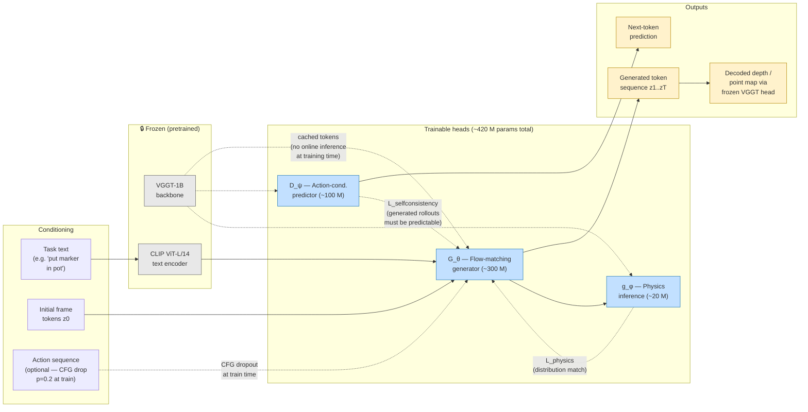
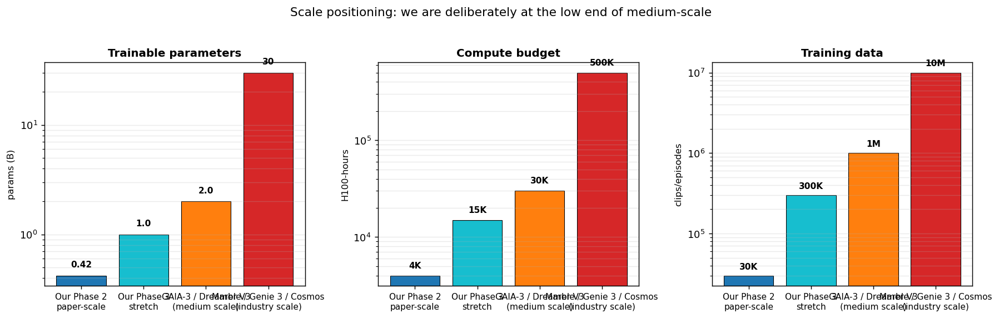
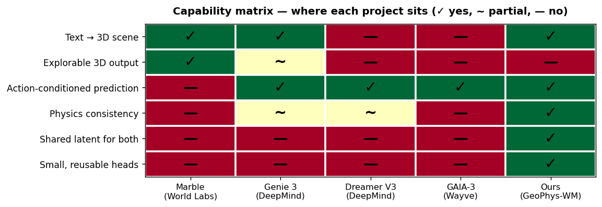
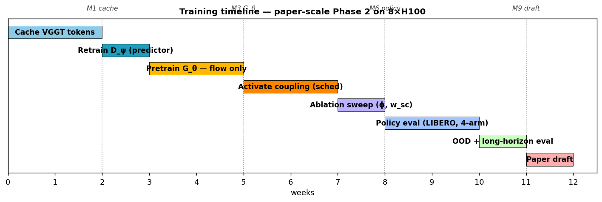

# GeoPhys-WM — an action-conditioned world model on frozen VGGT tokens

_One-page technical plan. Written 2026-04-22. Covers architecture, data, training, scale positioning, and path forward._

## The pitch, in one paragraph

Today's world-model research is split: **generative** models (Marble, Genie 3) build persistent 3D scenes from text but can't evolve them under actions; **predictive** models (Dreamer V3, GAIA-3) forecast action-conditioned dynamics but can't synthesize scenes. We build **one model that does both**, by training lightweight heads on the frozen tokens of VGGT — a geometric foundation model whose latent is rich enough for generation and structured enough for prediction. A classifier-free-guidance training scheme lets a single generator run either text→scene (like Marble) or (text, actions)→scene (like Genie), and a coupling loss against a frozen predictor enforces physical plausibility. Net result: an action-conditioned world model at **medium scale (~420 M trainable params, ~4 K H100-hours)**, standing on the shoulders of ~1 B parameters of free geometric understanding from VGGT.

---

## 1. Architecture at a glance



**Key ideas, in bullets:**

- **VGGT is frozen and cached.** At training time we operate on pre-computed token shards. This decouples training cost from VGGT inference cost, and makes iteration cheap.
- **Single generator, two conditioning modes.** `G_θ` trains with actions dropped p=0.2. At inference: sample with actions (action-conditioned world model, Genie-style) or without (pure text-to-scene, Marble-style).
- **Dual-head coupling is the novel loss.** `L_selfconsistency` penalises G_θ when D_ψ can't extrapolate its output — i.e. when the generated motion is unphysical. `L_physics` penalises g_φ-latent statistics drift between real and generated clips.
- **Schedule-based coupling is the default.** Pure flow matching for the first ~50% of epochs, coupling on afterwards. The Phase 2 prototype showed this is Pareto-optimal over always-on coupling.

---

## 2. Where we sit vs other world models





**Read the matrix as positioning, not as a scorecard.** Marble's persistent-3D output is a capability we deliberately don't match — that's Phase 3 territory. But no existing work combines **shared geometric latent**, **physics consistency**, and **small reusable heads** on a frozen backbone; that's where our methodological contribution lives.

---

## 3. Data recipe

| Bucket | Source | Size | Purpose | Storage |
|---|---|---|---|---|
| **Predictor + generator training (real)** | Open X-Embodiment subset (`bridge`, `fractal20220817`) + DROID-100 | 30 K clips, ~3 M frames | Train D_ψ and G_θ on real dynamics | ~375 GB as int8-quantised VGGT tokens |
| **Text conditioning** | DROID task strings + VLM-captioned frames (Claude API, ~$100 for 30 K) | 30 K (text, clip) pairs | G_θ text conditioning | negligible |
| **Policy benchmark** | LIBERO (130 tasks, public) | 10 held-out tasks | Downstream BC training + eval | ~10 GB |
| **OOD probe** | Franka-Kitchen + hand-curated edge cases | 20 clips | Test generalisation claim | ~500 MB |

**Two deliberate non-choices:**
- We do **not** use Marble / Cosmos / Genie API to bootstrap synthetic training data. Doing so couples our claim to their licenses and undermines "small-data methodological" framing.
- We do **not** attempt to scrape web-scale video. That's industry-scale territory and pulls the project out of the medium-scale tier where our contribution matters.

---

## 4. Training recipe

### Stages and what's trained at each stage

| Stage | What's trained | What's frozen | Loss | Duration |
|---|---|---|---|---|
| **S1. Cache tokens** | nothing | VGGT, CLIP | — | 2 weeks (3 M frames × 15 ms × 4 GPUs) |
| **S2. Retrain D_ψ** | predictor only | VGGT, CLIP | next-token MSE + cosine | ~300 H100-hrs, 1 week wall |
| **S3. G_θ pure flow matching** | generator | VGGT, CLIP, D_ψ | flow-matching MSE only | 20 epochs, ~100 H100-hrs |
| **S4. G_θ + coupling (sched20-style)** | generator + g_φ | VGGT, CLIP, D_ψ | flow-matching + w_sc·L_sc + w_ph·L_ph | 20 more epochs, ~400 H100-hrs |
| **S5. Ablation sweep** | small variants of S4 | same | same | ~500 H100-hrs |
| **S6. Policy training** | behavior-cloning policy | everything above | BC loss | ~1500 H100-hrs, 4 arms × 5 seeds × 3 data fractions |

### Coupling-loss schedule

The non-obvious recipe choice is **when** to activate coupling — prototype showed this matters more than the loss weights.

```
epoch  0       10       20       30       40
       |--------|--------|--------|--------|
       [====== pure flow matching =====]
                         [== + coupling on ==]
                         ↑
                         warmup boundary
                         w_sc: 0 → 1.0
                         w_ph: 0 → 0.1
```

### Full timeline (8×H100, single-node)



---

## 5. What we leverage (and what we don't)

| Reused from prior work | What it gives us | What it saves |
|---|---|---|
| **VGGT-1B (frozen)** | ~1 B params of 3D geometric understanding | ~1 M GPU-hrs of pretraining |
| **CLIP ViT-L/14 text (frozen)** | ~300 M params of text semantics | ~100 K GPU-hrs of pretraining |
| **Phase 1 `vggt_noact` predictor** | Known-good D_ψ architecture + weights to warm-start from | Days of architecture search |
| **DROID-100 cache from Phase 1** | 30 pre-cached clips for smoke tests | Several hours per iteration |
| **LIBERO + standard BC implementation** | Known-reference policy benchmark | ~1 month of evaluation-harness engineering |

**Deliberately not reused:**
- **Marble / Genie / Cosmos weights** — not public, restrictive licenses, wrong latent space.
- **Stable Video Diffusion / VDM** — pixel/VAE latent; transfer to VGGT token space is unclear.
- **V-JEPA 2** — open-ish, but its JEPA latent is a different representational bet.

---

## 6. How to make this industry-scale (Phase 3+, not this paper)

Phase 2 is explicitly medium-scale. If Phase 2 succeeds and we want to close the gap to Marble/Genie for a follow-up paper, the path looks like:

| Axis | Paper-scale Phase 2 | Industry-stretch Phase 3 | Requirement |
|---|---|---|---|
| Training data | 30 K clips (~3 M frames) | 10 M frames | Infra partner (OXE full pool + Web-video scrape) |
| G_θ params | 300 M | 1–3 B | 32–64× H100 cluster, FSDP+activation-checkpointing |
| Output modality | VGGT tokens → depth | Gaussian splats / explorable 3D | New decoder (research project in its own right) |
| Compute | 4 K H100-hrs | 50–100 K H100-hrs | Large cloud credit or academic allocation |
| Eval | LIBERO BC + token metrics | Real-robot teleoperation + human perceptual eval | Robotics collaborator |

The gap is real but tractable — 10–20× scale is roughly the "second paper" delta, not the "different project" delta.

**Middle ground** (~50 H100s, 6–8 wk): see [`STRETCH_PLAN.md`](STRETCH_PLAN.md) for the detailed recipe. Shorthand: 2.6 B trainable params, 400 K clips, 25 K H100-hours, new token→RGB decoder — medium-scale tier alongside GAIA-3 and Dreamer V3.

---

## 7. Answers to the three questions that prompted this doc

**Q. Can we make this action-conditioned?**
Yes, and we should. Add actions as an optional conditioning input to G_θ, train with classifier-free dropout (p=0.2). One model, two modes: text-only (Marble-like) or text + actions (Genie-like). This is the architecture diagrammed in §1.

**Q. Is this industry-scale? Can we leverage existing weights?**
Deliberately no on scale — see §2, the chart places us at the low end of *medium*-scale. We do leverage ~1.3 B params of frozen pretrained weights (VGGT + CLIP); that's the project's core bet. The only meaningful pre-existing *world-model* weight we can reuse is VGGT itself.

**Q. Does this bridge generative (Marble/Fei-Fei Li) + predictive (Dreamer) camps?**
Architecturally yes — see §1 and the capability matrix in §2: we're the only system with shared latent + dual heads + physics consistency + small trainable footprint. Output-format-wise, we don't match Marble's explorable-3D (token-sequence → depth vs gaussian-splat); that's Phase 3. The paper's honest claim is: *a methodological unification of the two architectural traditions at medium scale*, not a head-to-head with either.

---

## Further reading (in this repo)

- `PHASE2_PAPER_PLAN.md` — full milestone-by-milestone plan with gates and risks
- `PHASE2_KICKOFF.md` — handoff prompt for a future Claude Code session
- `EXPERIMENTS_EXPLAINED.md` — cross-discipline explainer (plain language + glossary)
- `PHASE1_REPORT.md`, `PHASE2_REPORT.md` — feasibility results this plan builds on
