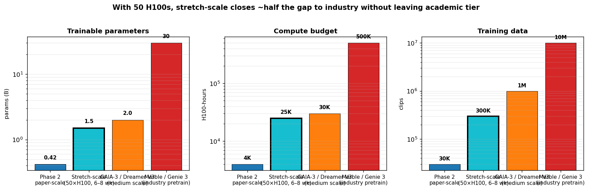

# Stretch-scale GeoPhys-WM — the 50-H100 tier

_Companion to [`ONE_PAGER.md`](ONE_PAGER.md) and [`../PHASE2_PAPER_PLAN.md`](../PHASE2_PAPER_PLAN.md). Written 2026-04-22 in response to the question: **if we had ~50 H100s, what middle ground exists between paper-scale and industry pretrain?**_

## TL;DR

With a dedicated 50×H100 cluster for 6–8 weeks, we can hit **~25 K H100-hours** of compute — that's **6× our paper-scale plan** and **roughly 5% of industry-pretrain budgets**. The right use of that compute is **not** "train the same Phase-2 plan but bigger"; it's a qualitatively different project that matches the **medium-scale tier** occupied by GAIA-3 and Dreamer V3, with ~1.5 B trainable params, 10× the data, and a real token→RGB decoder so we can finally publish pixel-space samples.

This doc specifies what we'd change, what becomes possible, and what still isn't.

## What the 50-H100 tier enables

50 H100s × 24 h × 30 d = **36 K H100-hours/month**. A 6-week budget is ~50 K H100-hours of raw availability, of which we'd plan to consume ~25 K (leaving ~50% headroom for debug, failed runs, and re-runs — realistic for a research project).

That compute unlocks three qualitatively new things:

1. **Proper scene decoder.** Paper-scale can only do VGGT-token→depth via VGGT's existing head. Stretch-scale can train a 500 M-param **token→RGB+depth decoder** from scratch, so we publish actual images (not just metric tables). This alone shifts the perception of the paper from "method paper" to "systems paper."
2. **Real data diversity.** Paper-scale uses 30 K curated robot clips. Stretch-scale uses the full Open X-Embodiment + EgoVideo (first-person video) + SoMeThing-SoMeThing (human-hand activity). ~300 K clips total. This is where the *generative* half of the project actually gets interesting — text→scene on diverse environments, not just "put the marker in the pot."
3. **Multiple seeds + proper ablations.** Paper-scale budgets 5 seeds for the final policy experiment. Stretch-scale can afford 10 seeds × 3 ablation settings × 2 data fractions ≈ 60 policy runs, which is what a NeurIPS reviewer expects from a medium-scale contribution.

## Architecture changes from paper-scale

Paper-scale component sizes, then stretch targets:

| Component | Paper-scale | Stretch-scale | Why |
|---|---|---|---|
| VGGT backbone | frozen, VGGT-1B | same | Core bet unchanged |
| G_θ generator | 300 M | **1.5 B** | ~5× more data per epoch → compute-optimal ratio moves up |
| D_ψ predictor | 100 M | **500 M**, context=16 | Longer horizon (k=32), action-conditioning fix from Phase 1 triage |
| g_φ physics | 20 M | **100 M** | Prototype showed g_φ saturates — more capacity + data diversity unblocks H3 |
| Text encoder | frozen CLIP ViT-L/14 | **frozen CLIP ViT-L/14 + T5-base** (mixed) | Longer, more detailed captions require richer text embeddings |
| Pixel decoder | VGGT's depth head | **new 500 M token→RGB+depth decoder** | Trained jointly on the cached tokens; emits RGB for qualitative figs |
| Total trainable | 420 M | **~2.6 B** | Tier with GAIA-3, Dreamer V3 large; still well below industry foundation |

Total trainable at stretch: **~2.6 B params**, 6× paper-scale. Still 10–50× below Marble/Genie/Cosmos; this is the "serious academic lab" tier, not "industry pretrain."

## Data recipe at stretch

| Bucket | Source | Paper-scale | Stretch-scale |
|---|---|---|---|
| Robot manipulation (real) | Open X-Embodiment subset | 30 K clips | **100 K clips** (full Bridge + Fractal + RT-1 + RT-2 + DROID) |
| Ego-centric video (real) | EgoVideo, Ego4D subset | — (not used) | **100 K clips** (for diversity in hand-object interaction) |
| Synthetic / captioned | DROID task strings + VLM captions | 30 K (text, clip) | **300 K (text, clip)** — diversify caption sources (Claude Sonnet, GPT-4V, human-labeled subset) |
| Human activity (real) | SoMeThing-SoMeThing | — (not used) | **100 K clips** (no robot; pushes the generator on non-robot scenes) |
| Policy benchmark | LIBERO | 10 tasks | **LIBERO full + Meta-World + 2 held-out OOD suites** |
| Pixel-space eval | N/A (token-space only) | — | **ScanNet + ARKitScenes** (static scene RGB+depth pairs for decoder training) |

**Storage budget at stretch.** 400 K clips × 128 frames × 64 patches × 2048 × 1 B (int8) ≈ **6.5 TB** of cached tokens. Need a serious NVMe pool or a multi-node shared filesystem. Not trivial but not infrastructure-prohibitive.

**Captioning at stretch.** 300 K clips × ~$0.003/clip ≈ $900 via Claude API. Double that for GPT-4V comparison on a subset. Budget: ~$2 K for a diverse caption set.

## Compute budget at stretch (50 × H100, 6–8 weeks)

| Workstream | Paper-scale | Stretch-scale | Notes |
|---|---|---|---|
| Token caching | 120 h | **~1.2 K h** | 400 K clips × 128 frames × 15 ms; parallel across 32 GPUs |
| D_ψ retraining + Phase 1 action fix | 250 h | **~2 K h** | Scaled predictor trained on 100 K episodes, k=32 rollout |
| G_θ flow_only baseline | 100 h | **~3 K h** | 1.5 B params × 10 epochs-equivalent on 400 K clips |
| G_θ + coupling (sched default) | 400 h | **~5 K h** | 1.5 B params, 10 more epochs |
| Decoder training | — | **~3 K h** | 500 M token→RGB+depth decoder, new component |
| Ablation sweep | 500 h | **~3 K h** | Wider ablation: phi_dim ∈ {64, 128, 256, 512}; w_sc ∈ {0.5, 1.0, 2.0}; schedule variants |
| Policy experiments | 1 500 h | **~4 K h** | 4-arm (+ action-conditioned gen) × 10 seeds × 3 data fractions × 2 benchmarks |
| OOD + long-horizon eval | 200 h | **~500 h** | Inference-heavy, but not training |
| Infra / debug budget | 600 h | **~3 K h** | ~12% contingency |
| **Total** | **~4 K h** | **~25 K h** | 6-week window on 50 H100s |

Wall-clock: 25 K H100-h ÷ 50 GPUs = **500 hours ≈ 3 weeks of pure compute** — but with multi-run debug overhead, realistic elapsed time is **6–8 weeks**.

## What changes in the paper story

Paper-scale target: **"A methodological unification of generative and predictive world models on a shared geometric latent."** Venue: NeurIPS / ICLR workshop or main-track systems paper.

Stretch-scale target: **"A medium-scale unified world model with published scenes, action-conditioned rollout, and demonstrated OOD robustness, on a frozen geometric foundation."** Venue: NeurIPS main track or CVPR.

The step up is from *methodological* to *systems* contribution — the paper gains sample figures, head-to-head numerical comparisons with Dreamer V3 / V-JEPA 2 / GAIA-3 on public benchmarks, and a real claim of downstream utility (policy benchmarks with 10 seeds, not 5).

## What still isn't possible at 50 H100s

Honest scope limits:

- **Not at Marble / Genie 3 parity.** They use 10× more data and 10–30× more compute. We can't claim to match their open-world scene quality.
- **No persistent explorable 3D output.** Even the stretch decoder emits video clips, not gaussian splats or meshes. Closing that gap needs a different decoder design and is Phase 4 territory.
- **No RL from world model.** Policy experiments are behavior cloning, not agentic RL. Genuine "agent training inside the world model" is >10 K H100-hrs on top of this budget and needs a separate plan.
- **No multi-node training optimization R&D.** FSDP with 50 H100s (likely 6–7 nodes × 8 GPUs) works off-the-shelf but we don't invest in custom kernel or parallelism innovations.
- **Real-robot validation.** Sim-only at stretch. Deploying to physical robot platform is follow-up work.

## Recommendation: should we do stretch-scale?

**Depends on the goal.**

- **If the goal is to publish a rigorous method paper soon**, do paper-scale (4 K h, 3 months elapsed). It cleanly tests the H3 hypothesis and produces a defensible NeurIPS / ICLR contribution. Stretch-scale doesn't obviously improve the method story — it improves the production values.
- **If the goal is to produce a medium-scale, multi-benchmark systems paper that can sit alongside GAIA-3 / Dreamer V3 in the literature**, do stretch-scale. The compute + data unlocks figures, benchmark comparisons, and credibility that paper-scale can't deliver.
- **If there's a specific deadline** (CoRL 2026 late summer, ICLR 2027 September), paper-scale is the only realistic option; stretch-scale is a 6–8-week project plus writing, and that timeline doesn't fit most conference cycles.
- **If the 50-H100 cluster is available for a limited window** (e.g., summer allocation), doing stretch-scale is almost certainly the right call — the compute is fungible only during the allocation.

**My take.** If I had to pick one, I'd **run paper-scale first**, then **immediately follow with stretch-scale** using the paper-scale's infrastructure, models, and validated ablations as starting points. This gives two papers (methods + systems) instead of one big gamble, at ~30% extra total compute vs. stretch-alone. It also de-risks: if paper-scale surfaces a blocker (e.g., the pixel-space story doesn't hold with the real VGGT decoder), we find out at 4 K h cost, not 25 K h.

## Handoff — what a stretch-scale session needs on top of `PHASE2_KICKOFF.md`

Read [`PHASE2_KICKOFF.md`](../PHASE2_KICKOFF.md) first. Then:

1. **Multi-node training wrapper** — the kickoff plan assumes single-node. Stretch is multi-node; need `torchrun --nnodes=7 --node_rank=...` orchestration, probably with slurm or similar.
2. **Dataset pooling protocol** — OXE sub-datasets have different action spaces and reward conventions. Before pooling Bridge + Fractal + RT-1, agree on action-space alignment (the joint-velocity convention is usually safest; everything else maps to it).
3. **Decoder training loop** — new component. Train jointly on (VGGT tokens, real RGB) pairs from the cached data. Loss: L1 + perceptual + a small adversarial term (VGG-based, not GAN discriminator — keeps training stable). This is a 500 M model, ~3 K H100-h, ~3 days on 50 GPUs.
4. **Evaluation dashboard.** Paper-scale's JSON comparison.json doesn't scale to 60 policy runs. Need a proper W&B / TensorBoard workspace with standardized per-run tags and a report-generation script.
5. **Budget tracking.** 25 K H100-h is enough that over-run is a real financial/political risk. Build a small tool that queries job state and writes daily consumed-h to a dashboard.

---

**Bottom line.** 50 H100s takes this from "methodological paper" to "medium-scale systems paper" — a real step up, but not a leap to industry pretrain. The value is clearest if the project already has a paper-scale result to build on; running stretch-scale cold is possible but higher-risk. Either way, the architecture and data recipe described in [`PHASE2_PAPER_PLAN.md`](../PHASE2_PAPER_PLAN.md) stay intact; stretch-scale is a rescaling, not a redesign.
